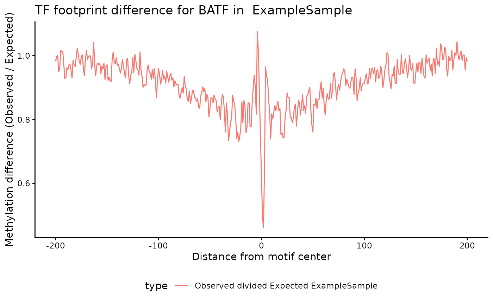
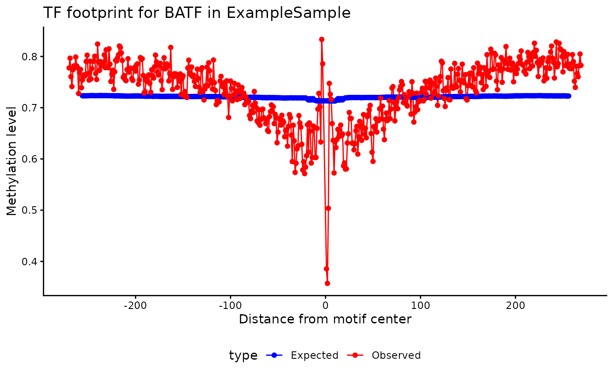

# methylTFR: Quantification of DNA Methylation Signatures in Transcription Factor Binding Sites

## Introduction

DNA methylation can modulate transcription factor (TF) binding,
particularly when occurring within transcription factor binding sites
(TFBS). `methylTFR` is an R package that identifies DNA methylation
signatures at TFBS using whole-genome bisulfite sequencing (WGBS) data.

For each sample, methylation levels are first aggregated across all
genomic regions corresponding to TFBS. This yields the **observed
deviation**, which captures the raw signal of methylation enrichment or
depletion for each TF. To account for sequence composition biases,
`methylTFR` then estimates an **expected deviation** using genomic
background models derived from TF motif GC content and genome-wide GC
frequency. This deviation matrix provides a compact and interpretable
representation of TFBS methylation across samples, suitable for
downstream analyses such as dimensionality reduction (e.g., PCA, UMAP),
clustering, differential testing, and visualization of TF-specific
methylation footprints.


## Installation

You can install the stable release of **methylTFR** from
[Bioconductor](https://bioconductor.org/) using:

``` r

if (!requireNamespace("BiocManager", quietly = TRUE)) {
  install.packages("BiocManager")
}

BiocManager::install("methylTFR")
```

To install the development version directly from GitHub:

``` r

if (!requireNamespace("remotes", quietly = TRUE)) {
  install.packages("remotes")
}
remotes::install_github("EpigenomeInformatics/methylTFR")
```

## Getting Started

To get started with **methylTFR**, load the package and its
dependencies:

``` r

library(methylTFR)
#> Loading required package: data.table
#> 
#> Attaching package: 'data.table'
#> The following object is masked from 'package:base':
#> 
#>     %notin%
#> 
#> Attaching package: 'methylTFR'
#> The following objects are masked from 'package:base':
#> 
#>     cbind, rbind
```

### Read a Sample File

The
[`read_methylome()`](https://epigenomeinformatics.github.io/methylTFR/reference/read_methylome.md)
function is used to import single-sample DNA methylation data into a
`GRanges` object.  
It supports several common file formats, including `EPP`, `ALLC`,
`BisSNP`, `bismarkCytosine`, `bismarkcov`, and `ENCODE`.

You can optionally filter out low-coverage sites using the
`cov_threshold` parameter (default = 1), which excludes positions with
insufficient read support.

Below is an example of reading an example `EPP`-formatted file provided
in the package:

``` r

epp_path <- system.file("extdata", "epp.tsv.gz", package = "methylTFR")
epp <- read_methylome(epp_path, "EPP")
epp
#> GRanges object with 6 ranges and 2 metadata columns:
#>       seqnames          ranges strand |     score  coverage
#>          <Rle>       <IRanges>  <Rle> | <numeric> <numeric>
#>   [1]     chr1 3010957-3010958      + |     1.000        27
#>   [2]     chr1 3010959-3010960      - |     0.500         7
#>   [3]     chr1 3010971-3010972      + |     1.000        20
#>   [4]     chr1 3010973-3010974      - |     0.500        20
#>   [5]     chr1 3011025-3011026      + |     0.814        70
#>   [6]     chr1 3011027-3011028      - |     0.500       100
#>   -------
#>   seqinfo: 1 sequence from an unspecified genome; no seqlengths
```

## Annotation Resources

We provide precomputed TFBS-based annotation data for the human genome
(*hg38*), which is required by `methylTFR` to compute expected
deviations.  
This includes transcription factor binding sites, GC content windows,
and motif GC frequency models.

You can download the *hg38*-compatible annotation package from the
following AWS-hosted archive:

- **[Download methylTFRAnnotationsHg38.tar.gz](https://aws-link-here)**

Optionally, you can create a customized annotation package for use with
`methylTFR` using the
[`methylTFRAnnotationBuilder`](https://github.com/EpigenomeInformatics/methylTFRAnnotationBuilder)
package available on **GitHub**.

### Input Data

`methylTFR` relies on several precomputed annotation resources to
estimate expected methylation levels at transcription factor binding
sites (TFBS). These annotations include:

- **GC distribution (`gcdist_subset`)**: Genome-wide GC content
  distribution around cytosines, used to model methylation expectations.
- **Motif GC frequency (`BATF_gcfreqs`)**: GC frequency profile specific
  to the BATF motif across TFBS, used to correct for sequence
  composition bias.
- **TF binding sites (`BATF_tf_bindsites`)**: A `GRanges` object
  containing the genomic coordinates of BATF binding sites.
- **Example methylation data (`example_data`)**: A small subset of
  methylation calls in EPP format, read using the
  [`read_methylome()`](https://epigenomeinformatics.github.io/methylTFR/reference/read_methylome.md)
  function, provided for demonstration purposes.

The following code loads these example datasets and displays the first
few entries:

``` r

# Load the data
load(system.file("extdata", "gcdist_subset.rda", package = "methylTFR"))
load(system.file("extdata", "BATF_gcfreqs.rda", package = "methylTFR"))
load(system.file("extdata", "BATF_tf_bindsites.rda", package = "methylTFR"))
load(system.file("extdata", "example_data.rda", package = "methylTFR"))


# Check the data
head(gcdist)
#> GRanges object with 6 ranges and 2 metadata columns:
#>       seqnames      ranges strand |   GC_bias    GC_bin
#>          <Rle>   <IRanges>  <Rle> | <numeric> <integer>
#>   [1]     chr1 10471-10500      * |  0.866667         5
#>   [2]     chr1 10591-10620      * |  0.633333         5
#>   [3]     chr1 10621-10650      * |  0.800000         5
#>   [4]     chr1 13051-13080      * |  0.700000         5
#>   [5]     chr1 13261-13290      * |  0.666667         5
#>   [6]     chr1 13291-13320      * |  0.600000         5
#>   -------
#>   seqinfo: 22 sequences from an unspecified genome
head(gcfreqs$BATF[, 1:5])
#>           [,1]      [,2]      [,3]      [,4]      [,5]
#> [1,] 0.1398816 0.1394321 0.1386829 0.1366599 0.1361355
#> [2,] 0.1538173 0.1546415 0.1580880 0.1591369 0.1620589
#> [3,] 0.1962239 0.2001199 0.1965985 0.1973477 0.1916536
#> [4,] 0.2734697 0.2706226 0.2724957 0.2718214 0.2769911
#> [5,] 0.2366075 0.2351839 0.2341350 0.2350341 0.2331610
head(tf_bindsites)
#> $BATF
#> GRanges object with 268717 ranges and 1 metadata column:
#>            seqnames            ranges strand |     score
#>               <Rle>         <IRanges>  <Rle> | <numeric>
#>        [1]     chr1       47430-47840      + |   16.7687
#>        [2]     chr1       57232-57642      + |   13.2598
#>        [3]     chr1       93216-93626      + |   14.9499
#>        [4]     chr1       96525-96935      + |   13.6042
#>        [5]     chr1       99285-99695      + |   13.9006
#>        ...      ...               ...    ... .       ...
#>   [268713]     chrY 57027771-57028181      - |   15.5241
#>   [268714]     chrY 57050236-57050646      - |   14.0836
#>   [268715]     chrY 57074721-57075131      - |   13.8672
#>   [268716]     chrY 57080582-57080992      - |   13.3138
#>   [268717]     chrY 57166552-57166962      - |   13.3138
#>   -------
#>   seqinfo: 24 sequences from an unspecified genome; no seqlengths
head(msites)
#> GRanges object with 6 ranges and 2 metadata columns:
#>       seqnames      ranges strand |     score  coverage
#>          <Rle>   <IRanges>  <Rle> | <numeric> <integer>
#>   [1]     chr1 10471-10472      - |         1         9
#>   [2]     chr1 10608-10609      + |         0         2
#>   [3]     chr1 10609-10610      - |         1         1
#>   [4]     chr1 10616-10617      + |         0         2
#>   [5]     chr1 10617-10618      - |         1         1
#>   [6]     chr1 10619-10620      + |         0         2
#>   -------
#>   seqinfo: 170 sequences from an unspecified genome; no seqlengths
```

## Compute Deviation Score for a Single Sample and Single Motif

The
[`computeDeviation()`](https://epigenomeinformatics.github.io/methylTFR/reference/computeDeviation.md)
function calculates the deviation score for a specific transcription
factor (TF) motif in a single sample. It compares the observed
methylation at TF binding sites (TFBS) to the expected methylation
derived from GC frequency models.

This example uses the `BATF` motif and the example methylation dataset
loaded earlier. The methylation data must first be binned by GC content
using
[`addGCBintoMethylome()`](https://epigenomeinformatics.github.io/methylTFR/reference/addGCBintoMethylome.md)
before computing the deviation.

``` r

# Add GC bins to methylation data
bin_meth <- addGCBintoMethylome(msites, gcdist, ignoreStrand = TRUE)
#> Loading required namespace: GenomeInfoDb
bin_meth
#>      gcbin avg_mscore
#> [1,]     1  0.5315789
#> [2,]     2  0.6466688
#> [3,]     3  0.7217031
#> [4,]     4  0.7091566
#> [5,]     5  0.7838198

# Compute deviation score for BATF motif
deviation_score <- computeDeviation(
    motif = "BATF",
    msites = msites,
    tf_bindsites = tf_bindsites,
    gcfreqs = gcfreqs,
    enhancer = NULL,
    ignoreStrand = TRUE,
    binMsites = bin_meth
)

# View the result
deviation_score
#>         dev   exp_dev
#>       <num>     <num>
#> 1: 1.743674 0.9835985
```

## Run methylTFR on multiple samples and motifs

The `methylTFR` package provides a `run_methyltfr` function to run the
analysis on multiple samples and motif sites. You need to download the
annotation package for the human genome (*hg38*) and place it in your
working directory.

``` r

library(methylTFRAnnotationHg38) # annotation package for hg38

gcfreqs <- getGCfreq(motifSet = "jaspar2020")
gc_dist <- getGenomeGC("hg38")
tf_bindsites <- getTFbindsites(motifSet = "jaspar2020")

sample_dir <- file.path("samples_dir")
sample_ann <- "samples.tsv" # should contain column name bedFile

# deviation score matrix
deviations <- run_methyltfr(sample_ann, # sample annotation file
    sample_dir, # where the EPP files are
    threads = 8, # number of threads
    chunkSize = 10, # number of chunks to process
    sampleColName = "bedFile", # column name for EPP file paths in sample_ann
    tf_bindsites = tf_bindsites, # TF binding sites
    gcfreqs = gcfreqs, # GC frequency
    gc_dist = gc_dist, # GC distribution
    filetype = "EPP" # file type
)
```

## Motif Footprinting

The `methylTFR` package provides a `plotMotifFootprint` function to
visualize the methylation footprint of a specific TF motif per sample.

``` r

library(ggplot2)
load(system.file("extdata", "msites_sub.rda", package = "methylTFR"))
load(system.file("extdata", "gcdist_BATF.rda", package = "methylTFR"))

p <- plotMotifFootprint(
    motif = "BATF",
    tf_bindsites = tf_bindsites,
    gc_dist = gcdist,
    gcfreqs = gcfreqs,
    msites = msites_sub,
    sample_name = "ExampleSample",
    enhancer = NULL,
    method = "division"
)
p
#> Warning: Removed 112 rows containing missing values or values outside the scale range
#> (`geom_line()`).
```



### Expected vs Observed Footprint

To visually assess how observed methylation patterns compare with
expected profiles at transcription factor binding sites (TFBS),
`methylTFR` provides the
[`plotExpectedFootprint()`](https://epigenomeinformatics.github.io/methylTFR/reference/plotExpectedFootprint.md)
function. This generates a footprint plot for a given motif in a single
sample, allowing you to inspect local methylation behavior relative to
GC-derived expectations.

In the example below, we visualize the methylation footprint for the
`BATF` motif using the included example data.

``` r

# Generate footprint plot for BATF
p <- plotExpectedFootprint(
    motif = "BATF",
    tf_bindsites = tf_bindsites,
    msites = msites_sub,
    sample_name = "ExampleSample",
    gc_dist = gcdist,
    gcfreqs = gcfreqs,
    enhancer = NULL,
    returnPlotData = FALSE
)

p
```



## Differential TF Activity Analysis

To assess differential TF activity between two groups of samples,
`methylTFR` provides the
[`differential_deviation_test()`](https://epigenomeinformatics.github.io/methylTFR/reference/differential_deviation_test.md)
function. This function computes the observed and expected deviation
scores for each TF motif across the specified groups, enabling
statistical testing to identify differentially active TFs.

This is how `methylTFRdeviations` object is looked like:

``` r

load(system.file("extdata", "tc_mem.rda", package = "methylTFR"))
load(system.file("extdata", "tc_naive.rda", package = "methylTFR"))
devs <- cbind(tc_mem, tc_naive)
devs
#> class: methylTFRdeviations 
#> dim: 10 10 
#> metadata(0):
#> assays(2): deviations z
#> rownames(10): FOXF2 FOXD1 ... RORA RORA(var.2)
#> rowData names(1): motifs
#> colnames(10): Tc-Mem_OP_S5_Long_D1.bedGraph.bed
#>   Tc-Mem_OP_S4_Long_D60.bedGraph.bed ...
#>   Tc-Naive_OP_S4_Long_D1.bedGraph.bed
#>   Tc-Naive_OP_S3_High_D1.bedGraph.bed
#> colData names(4): CommonMinID condition cell_type bedFile
```

``` r

# Construct group labels from sample names
get_groupname <- function(x) {
    return(unlist(strsplit(x, split = "_"))[1])
}
groups <- sub(
    ".bedGraph", "",
    unlist(lapply(
        FUN = get_groupname,
        X = colnames(devs)
    ))
)
table(groups)
#> groups
#>   Tc-Mem Tc-Naive 
#>        5        5

# Run the differential deviation test
tc_result <- differential_deviation_test(
    deviations = devs,
    groups = groups,
    alternative = "two.sided",
    parametric = TRUE,
    padjMethod = "BH"
)

# View the results
head(tc_result)
#>                  motifs      p_value p_value_adjusted mean_difference
#> FOXF2             FOXF2 1.694736e-02     0.0355317162      0.02920759
#> FOXD1             FOXD1 3.644010e-01     0.4555013119      0.01081636
#> IRF2               IRF2 1.873667e-03     0.0093683362      0.03414276
#> MZF1(var.2) MZF1(var.2) 1.776586e-02     0.0355317162      0.01850831
#> MAX::MYC       MAX::MYC 1.078111e-05     0.0001078111      0.09341429
#> PPARG             PPARG 3.996324e-03     0.0133210805      0.03428684
```

## Session Information

``` r

sessionInfo()
#> R version 4.6.0 (2026-04-24)
#> Platform: x86_64-pc-linux-gnu
#> Running under: Ubuntu 24.04.4 LTS
#> 
#> Matrix products: default
#> BLAS:   /usr/lib/x86_64-linux-gnu/openblas-pthread/libblas.so.3 
#> LAPACK: /usr/lib/x86_64-linux-gnu/openblas-pthread/libopenblasp-r0.3.26.so;  LAPACK version 3.12.0
#> 
#> locale:
#>  [1] LC_CTYPE=C.UTF-8       LC_NUMERIC=C           LC_TIME=C.UTF-8       
#>  [4] LC_COLLATE=C.UTF-8     LC_MONETARY=C.UTF-8    LC_MESSAGES=C.UTF-8   
#>  [7] LC_PAPER=C.UTF-8       LC_NAME=C              LC_ADDRESS=C          
#> [10] LC_TELEPHONE=C         LC_MEASUREMENT=C.UTF-8 LC_IDENTIFICATION=C   
#> 
#> time zone: UTC
#> tzcode source: system (glibc)
#> 
#> attached base packages:
#> [1] stats     graphics  grDevices utils     datasets  methods   base     
#> 
#> other attached packages:
#> [1] ggplot2_4.0.3     methylTFR_0.99.0  data.table_1.18.4 BiocStyle_2.40.0 
#> 
#> loaded via a namespace (and not attached):
#>  [1] SummarizedExperiment_1.42.0 gtable_0.3.6               
#>  [3] xfun_0.58                   bslib_0.11.0               
#>  [5] rhdf5_2.56.0                Biobase_2.72.0             
#>  [7] lattice_0.22-9              rhdf5filters_1.24.0        
#>  [9] vctrs_0.7.3                 tools_4.6.0                
#> [11] generics_0.1.4              stats4_4.6.0               
#> [13] parallel_4.6.0              R.oo_1.27.1                
#> [15] Matrix_1.7-5                RColorBrewer_1.1-3         
#> [17] S7_0.2.2                    desc_1.4.3                 
#> [19] S4Vectors_0.50.1            lifecycle_1.0.5            
#> [21] compiler_4.6.0              farver_2.1.2               
#> [23] stringr_1.6.0               textshaping_1.0.5          
#> [25] Seqinfo_1.2.0               GenomeInfoDb_1.48.0        
#> [27] htmltools_0.5.9             sass_0.4.10                
#> [29] yaml_2.3.12                 pkgdown_2.2.0              
#> [31] jquerylib_0.1.4             R.utils_2.13.0             
#> [33] DelayedArray_0.38.2         cachem_1.1.0               
#> [35] abind_1.4-8                 digest_0.6.39              
#> [37] stringi_1.8.7               bookdown_0.46              
#> [39] labeling_0.4.3              fastmap_1.2.0              
#> [41] grid_4.6.0                  cli_3.6.6                  
#> [43] SparseArray_1.12.2          logger_0.4.2               
#> [45] magrittr_2.0.5              S4Arrays_1.12.0            
#> [47] h5mread_1.4.0               withr_3.0.2                
#> [49] scales_1.4.0                UCSC.utils_1.8.0           
#> [51] httr_1.4.8                  rmarkdown_2.31             
#> [53] XVector_0.52.0              matrixStats_1.5.0          
#> [55] otel_0.2.0                  ragg_1.5.2                 
#> [57] R.methodsS3_1.8.2           HDF5Array_1.40.0           
#> [59] evaluate_1.0.5              knitr_1.51                 
#> [61] GenomicRanges_1.64.0        IRanges_2.46.0             
#> [63] rlang_1.2.0                 glue_1.8.1                 
#> [65] BiocManager_1.30.27         BiocGenerics_0.58.1        
#> [67] jsonlite_2.0.0              R6_2.6.1                   
#> [69] Rhdf5lib_2.0.0              MatrixGenerics_1.24.0      
#> [71] systemfonts_1.3.2           fs_2.1.0
```
