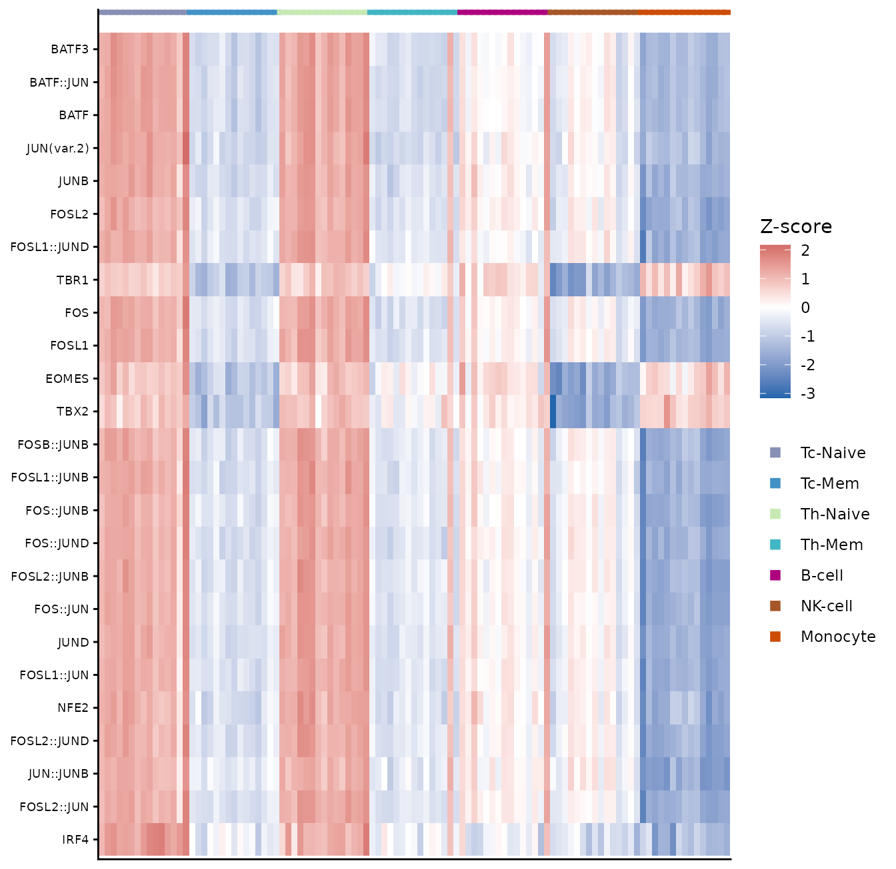
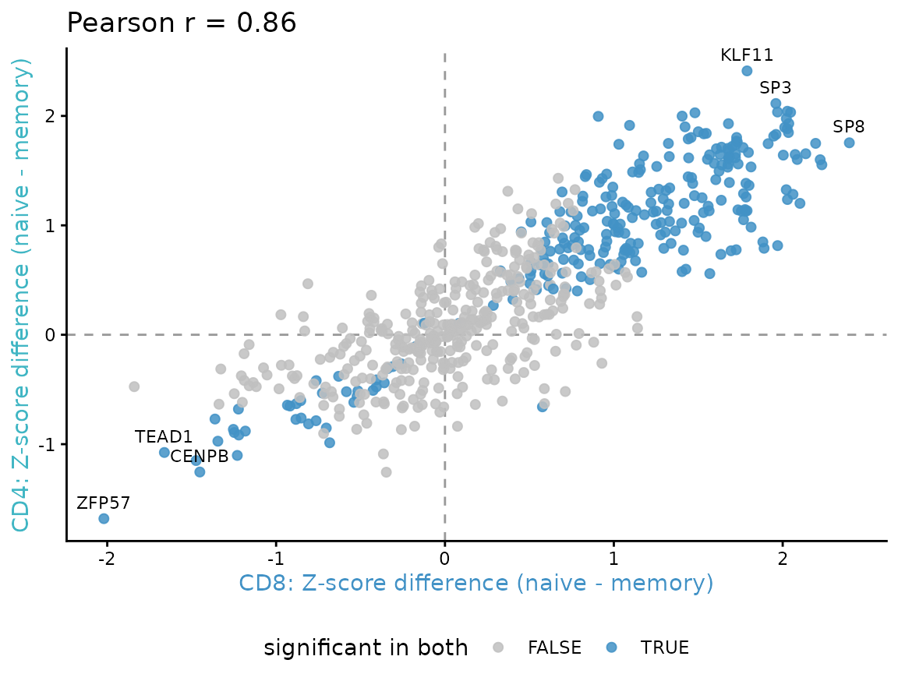
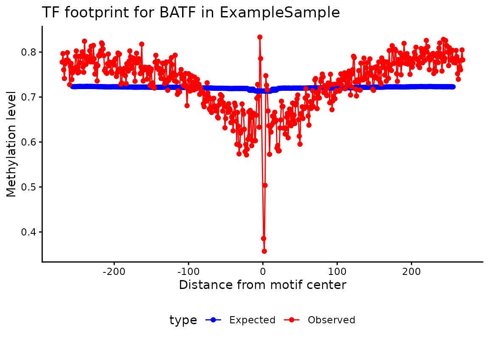
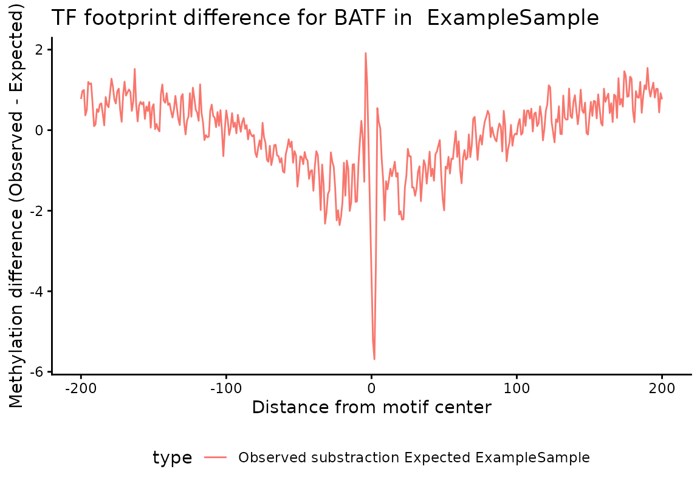

# Case study: TF activity in memory vs. naive T cells

## Introduction

This vignette demonstrates a complete downstream analysis of
*[methylTFR](https://bioconductor.org/packages/3.20/methylTFR)*
deviation scores, starting from a precomputed `methylTFRdeviations`
object. It covers dimensionality reduction, differential activity
testing between two groups, comparison of two independent contrasts, and
inspection of the motif footprints that the deviation scores summarise.

The biological setting is the naive-to-memory transition in human T
cells, in the cytotoxic (CD8, `Tc`) and helper (CD4, `Th`) compartments.
All quantities are derived from DNA methylation.

The following
*[methylTFR](https://bioconductor.org/packages/3.20/methylTFR)*
functionality is demonstrated:

| Step | Function |
|----|----|
| Access bias-corrected deviation scores | [`deviations()`](https://epigenomeinformatics.github.io/methylTFR/reference/deviations.md) |
| Access row-wise deviation Z-scores | [`deviationZScores()`](https://epigenomeinformatics.github.io/methylTFR/reference/deviationZScores.md) |
| Rank motifs by activity variability | [`computeZScoreVariability()`](https://epigenomeinformatics.github.io/methylTFR/reference/computeZScoreVariability.md) |
| Test motifs between two groups | [`differential_deviation_test()`](https://epigenomeinformatics.github.io/methylTFR/reference/differential_deviation_test.md) |
| Plot observed and expected methylation | [`plotExpectedFootprint()`](https://epigenomeinformatics.github.io/methylTFR/reference/plotExpectedFootprint.md) |
| Plot the bias-corrected footprint | [`plotMotifFootprint()`](https://epigenomeinformatics.github.io/methylTFR/reference/plotMotifFootprint.md) |

Deviation scores themselves are computed with
[`run_methyltfr()`](https://epigenomeinformatics.github.io/methylTFR/reference/run_methyltfr.md)
from per-sample methylation files, or with
[`run_methylTFR_RnBeads()`](https://epigenomeinformatics.github.io/methylTFR/reference/run_methylTFR_RnBeads.md)
directly from a preprocessed `RnBeads` object. Both are covered in the
[Get
started](https://epigenomeinformatics.github.io/methylTFR/articles/methylTFR.md)
vignette; this one begins from their output.

``` r
library(methylTFR)
#> Warning: multiple methods tables found for 'sort'
#> Warning: multiple methods tables found for 'sort'
#> Warning: replacing previous import 'S4Arrays::read_block' by
#> 'DelayedArray::read_block' when loading 'HDF5Array'
#> Warning: replacing previous import 'S4Arrays::read_block' by
#> 'DelayedArray::read_block' when loading 'SummarizedExperiment'
#> Warning: multiple methods tables found for 'sort'
library(SummarizedExperiment)
library(ggplot2)
```

A single palette is used for the seven cell types throughout, so that a
colour denotes the same cell type in every figure.

``` r
cell_type_colors <- c(
    "Th-Mem"   = "#41B6C4",
    "Tc-Mem"   = "#4292C6",
    "Tc-Naive" = "#888FB5",
    "Th-Naive" = "#C7E9B4",
    "B-cell"   = "#AE017E",
    "NK-cell"  = "#A65628",
    "Monocyte" = "#CC4C02"
)
```

## The example dataset

`immuneDeviations` contains bias-corrected deviation scores for
pseudobulk methylomes of seven human immune cell types, with one column
per donor sample and one row per JASPAR2020 motif. Four of the seven are
T cell subsets, naive and memory in the cytotoxic and helper
compartments; the remaining three provide a lineage contrast.

The underlying methylomes are from Gündüz *et al.* (2025); see the
References section.

``` r
load(system.file("extdata", "immuneDeviations.rda", package = "methylTFR"))
immuneDeviations
#> class: methylTFRdeviations 
#> dim: 629 105 
#> metadata(5): motifSet genome source citation contrastOrientation
#> assays(2): deviations z
#> rownames(629): FOXF2 FOXD1 ... ZNF263 CREM
#> rowData names(1): motifs
#> colnames(105): Tc-Naive_OP_S5_Long_D1.bedGraph.bed
#>   Tc-Naive_OP_S4_Long_D1.bedGraph.bed ...
#>   Monocyte_HIV_S3_Pre.bedGraph.bed Monocyte_HIV_S2_Pre.bedGraph.bed
#> colData names(3): CommonMinID condition cell_type

table(colData(immuneDeviations)$cell_type)
#> 
#> Tc-Naive   Tc-Mem Th-Naive   Th-Mem   B-cell  NK-cell Monocyte 
#>       15       15       15       15       15       15       15
```

Provenance is stored in the object metadata.

``` r
metadata(immuneDeviations)
#> $motifSet
#> [1] "jaspar2020_distal"
#> 
#> $genome
#> [1] "hg38"
#> 
#> $source
#> [1] "Pseudobulk single-cell methylomes of human immune cells; see inst/scripts/tcell_data.R"
#> 
#> $citation
#> [1] "Gunduz IB, Wei B, Chen DC, Wang W, Hariharan M, Norell T, et al. Dissecting epigenome dynamics in human immune cells upon viral and chemical exposure by multimodal single-cell profiling. bioRxiv 2025.09.09.675101. doi:10.1101/2025.09.09.675101"
#> 
#> $contrastOrientation
#> [1] "naive minus memory"
```

The source dataset provides 38 donor samples per cell type. To limit the
package size it was reduced on the sample axis only, to 15 samples per
cell type; every motif is retained. Subsetting motifs would be the more
obvious reduction, but selecting motifs by variability and then
demonstrating
[`computeZScoreVariability()`](https://epigenomeinformatics.github.io/methylTFR/reference/computeZScoreVariability.md)
on the result would be circular. The script used to generate the object
is `inst/scripts/tcell_data.R`.

### Accessing the two assays

A `methylTFRdeviations` object stores two matrices.
[`deviations()`](https://epigenomeinformatics.github.io/methylTFR/reference/deviations.md)
returns the bias-corrected deviation scores.
[`deviationZScores()`](https://epigenomeinformatics.github.io/methylTFR/reference/deviationZScores.md)
returns the same values standardised row-wise across samples.

``` r
dev_mat <- deviations(immuneDeviations)
z_mat <- deviationZScores(immuneDeviations)

round(dev_mat[seq_len(3), seq_len(4)], 4)
#>       Tc-Naive_OP_S5_Long_D1.bedGraph.bed Tc-Naive_OP_S4_Long_D1.bedGraph.bed
#> FOXF2                             -0.0184                             -0.0467
#> FOXD1                             -0.0226                             -0.0562
#> IRF2                              -0.0862                             -0.0703
#>       Tc-Naive_OP_S3_High_D1.bedGraph.bed Tc-Naive_OP_S1_Long_D60.bedGraph.bed
#> FOXF2                             -0.0069                              -0.0262
#> FOXD1                             -0.0459                              -0.0590
#> IRF2                              -0.0727                              -0.0662
```

The two assays serve different purposes. Deviation scores are the
quantitative estimate of motif activity and are the correct input to
statistical tests. Row-wise Z-scores rescale every motif to a common
spread, which makes rows comparable in a heatmap, but by construction
the standard deviation of each row is 1.

``` r
summary(as.vector(dev_mat))
#>     Min.  1st Qu.   Median     Mean  3rd Qu.     Max. 
#> -0.59307 -0.07932 -0.04501 -0.05839 -0.01590  0.25059
summary(apply(z_mat, 1, sd))
#>    Min. 1st Qu.  Median    Mean 3rd Qu.    Max. 
#>       1       1       1       1       1       1
```

## 1. Dimensionality reduction

Deviation scores form a low-dimensional feature set, so principal
component analysis can be applied to the matrix directly.

``` r
pca <- prcomp(t(dev_mat), center = TRUE, scale. = FALSE)
var_expl <- round(100 * pca$sdev^2 / sum(pca$sdev^2), 1)

pca_df <- data.frame(
    PC1 = pca$x[, 1], PC2 = pca$x[, 2],
    cell_type = colData(immuneDeviations)$cell_type
)

ggplot(pca_df, aes(PC1, PC2, colour = cell_type)) +
    geom_point(size = 2, alpha = 0.85) +
    scale_colour_manual(values = cell_type_colors, name = NULL) +
    labs(
        x = sprintf("PC1 (%.1f%%)", var_expl[1]),
        y = sprintf("PC2 (%.1f%%)", var_expl[2])
    ) +
    theme_classic()
```


PC1 separates the myeloid samples from the lymphoid ones. PC2 resolves
the T cell subsets by differentiation state: the two naive subsets group
together, as do the two memory subsets, while the CD8 and CD4
compartments overlap. Differentiation state therefore accounts for more
of the variation in motif activity than the CD8/CD4 distinction does.

## 2. Differential TF activity

### Ranking motifs by variability

Before testing a specific contrast,
[`computeZScoreVariability()`](https://epigenomeinformatics.github.io/methylTFR/reference/computeZScoreVariability.md)
ranks motifs by how much their activity varies across the dataset,
without requiring group labels. Each sample is calibrated against a null
estimated across motifs, so a variability above 1 indicates a motif
varying more than the background spread of that sample. P-values come
from a chi-squared test against that null.

``` r
variability <- computeZScoreVariability(immuneDeviations, method = "robust")
variability <- variability[order(-variability$variability), ]

head(variability, 8)
#>     motifs variability      p_value p_value_adjusted
#> 251  CEBPB    2.385501 2.555694e-69     1.607532e-66
#> 252  CEBPE    2.334669 7.513492e-65     2.362993e-62
#> 253  CEBPG    2.280077 3.323940e-60     6.969193e-58
#> 553  CEBPA    2.017053 4.419411e-40     6.949523e-38
#> 554  CEBPD    1.975119 3.170841e-37     3.988918e-35
#> 269  GMEB2    1.947420 2.154569e-35     2.258706e-33
#> 69     DBP    1.866374 2.780146e-30     2.498160e-28
#> 256    TEF    1.790718 7.481124e-26     5.882034e-24
```

The highest-ranking motifs belong to the CEBP family, which distinguish
the myeloid lineage from the lymphoid ones. This is a screen across all
cell types and requires no group labels, which makes it complementary to
the two-group test used below.

This function reads the `deviations` assay. Supplying row-wise Z-scores
instead would be uninformative, because their per-row standard deviation
is 1 for every motif, as shown above.

Optional bootstrap confidence bounds are available via
`bootstrap = TRUE`.

### Testing between two groups

[`differential_deviation_test()`](https://epigenomeinformatics.github.io/methylTFR/reference/differential_deviation_test.md)
tests each motif for a difference in deviation scores between two
groups. With two groups and `parametric = TRUE` the test is a Welch
t-test; p-values are adjusted with the Benjamini-Hochberg procedure.

The returned `mean_difference` column is unsigned, so the direction of
each change is computed separately. Differences below are oriented as
naive minus memory, so that a positive value indicates a higher
deviation score in the naive state.

``` r
compare_subsets <- function(object, naive, memory) {
    grp_all <- colData(object)$cell_type
    keep <- grp_all %in% c(naive, memory)
    grp <- factor(as.character(grp_all[keep]), levels = c(naive, memory))

    dev_sub <- deviations(object)[, keep, drop = FALSE]
    z_sub <- deviationZScores(object)[, keep, drop = FALSE]
    is_naive <- grp == naive

    res <- differential_deviation_test(
        deviations = dev_sub,
        groups = grp,
        alternative = "two.sided",
        parametric = TRUE,
        padjMethod = "BH"
    )
    res$diff <- rowMeans(dev_sub[, is_naive, drop = FALSE]) -
        rowMeans(dev_sub[, !is_naive, drop = FALSE])
    res$zdiff <- rowMeans(z_sub[, is_naive, drop = FALSE]) -
        rowMeans(z_sub[, !is_naive, drop = FALSE])
    res[order(res$p_value_adjusted), ]
}

tc_res <- compare_subsets(immuneDeviations, "Tc-Naive", "Tc-Mem")
th_res <- compare_subsets(immuneDeviations, "Th-Naive", "Th-Mem")

head(tc_res, 8)
#>                  motifs      p_value p_value_adjusted mean_difference
#> BATF3             BATF3 8.849438e-20     5.566296e-17      0.11777405
#> BATF::JUN     BATF::JUN 2.282248e-19     7.177671e-17      0.11601928
#> BATF               BATF 5.255967e-19     1.102001e-16      0.11884510
#> JUN(var.2)   JUN(var.2) 1.529002e-18     2.404355e-16      0.11285040
#> JUNB               JUNB 4.117214e-17     5.179456e-15      0.12884298
#> FOSL2             FOSL2 5.469143e-17     5.733484e-15      0.08754993
#> FOSL1::JUND FOSL1::JUND 6.586962e-17     5.918856e-15      0.10381391
#> TBR1               TBR1 1.071089e-16     8.421438e-15      0.07404221
#>                   diff    zdiff
#> BATF3       0.11777405 2.033917
#> BATF::JUN   0.11601928 2.011964
#> BATF        0.11884510 2.027036
#> JUN(var.2)  0.11285040 2.036036
#> JUNB        0.12884298 1.913842
#> FOSL2       0.08754993 1.681151
#> FOSL1::JUND 0.10381391 1.684212
#> TBR1        0.07404221 1.889798
```

### Choosing an effect-size threshold

The helper above returns two effect sizes on different scales. `diff` is
the difference in raw deviation scores; `zdiff` is the same contrast
expressed in Z-score units. A threshold must be applied on the scale it
was defined for, since the two ranges differ by an order of magnitude.

``` r
range(tc_res$diff)
#> [1] -0.08801462  0.12884298
range(tc_res$zdiff)
#> [1] -2.019887  2.394668

sum(tc_res$p_value_adjusted < 0.05)
#> [1] 340
sum(tc_res$p_value_adjusted < 0.05 & abs(tc_res$zdiff) > 0.5)
#> [1] 312
```

### Visualising the differential motifs

The motifs with the strongest change in the CD8 comparison are shown as
row-wise Z-scores across all four subsets. Samples are ordered by
subset, and the annotation row uses the palette defined above. The fill
scale is diverging and encodes the Z-score, which is a property of the
motif rather than of the subset.

``` r
top_motifs <- head(
    tc_res$motifs[
        tc_res$p_value_adjusted < 0.05 & abs(tc_res$zdiff) > 0.5
    ], 25
)

sample_order <- order(colData(immuneDeviations)$cell_type)
z_top <- z_mat[top_motifs, sample_order, drop = FALSE]
sample_levels <- colnames(z_top)
subset_of <- colData(immuneDeviations)$cell_type[sample_order]

heat_df <- data.frame(
    motif = factor(
        rep(rownames(z_top), times = ncol(z_top)),
        levels = rev(top_motifs)
    ),
    sample = factor(
        rep(sample_levels, each = nrow(z_top)), levels = sample_levels
    ),
    z = as.vector(z_top)
)

ann_df <- data.frame(
    sample = factor(sample_levels, levels = sample_levels),
    cell_type = subset_of
)

ggplot() +
    geom_tile(data = heat_df, aes(sample, motif, fill = z)) +
    geom_point(
        data = ann_df,
        aes(sample, y = length(top_motifs) + 1.2, colour = cell_type),
        shape = 15, size = 2.4
    ) +
    scale_fill_gradient2(
        low = "#2166AC", mid = "white", high = "#B2182B",
        midpoint = 0, name = "Z-score"
    ) +
    scale_colour_manual(values = cell_type_colors, name = NULL) +
    labs(x = NULL, y = NULL) +
    theme_classic() +
    theme(
        axis.text.x = element_blank(),
        axis.ticks.x = element_blank(),
        axis.text.y = element_text(size = 7),
        legend.position = "right"
    )
```



Most of the selected motifs belong to the AP-1 family. Their pattern is
consistent across both T compartments, high in the naive subsets and low
in the memory subsets, and lowest of all in monocytes. The T-box motifs
`EOMES`, `TBR1` and `TBX2` follow a different pattern, low in cytotoxic
memory T cells and in NK cells, which is where those factors are active.
Including the non-T lineages makes clear that the memory signature is
not simply a general lymphoid-myeloid contrast.

## 3. Comparing the two compartments

The CD8 and CD4 contrasts are computed from disjoint sets of samples.
Plotting the Z-score differences against each other shows whether the
two compartments identify the same motifs.

``` r
shared <- intersect(tc_res$motifs, th_res$motifs)
agree <- data.frame(
    motifs = shared,
    tc = tc_res$zdiff[match(shared, tc_res$motifs)],
    th = th_res$zdiff[match(shared, th_res$motifs)]
)
agree$sig_both <-
    tc_res$p_value_adjusted[match(shared, tc_res$motifs)] < 0.05 &
        th_res$p_value_adjusted[match(shared, th_res$motifs)] < 0.05

rho <- cor(agree$tc, agree$th)
round(rho, 3)
#> [1] 0.864
sum(agree$sig_both)
#> [1] 268
```

``` r
# Label the extremes at both ends: the strongest motifs cluster tightly,
# so ranking by magnitude alone places every label in one corner.
ranked <- agree[order(agree$tc + agree$th), ]
labelled <- rbind(head(ranked, 4), tail(ranked, 4))

ggplot(agree, aes(tc, th)) +
    geom_hline(yintercept = 0, linetype = "dashed", colour = "grey60") +
    geom_vline(xintercept = 0, linetype = "dashed", colour = "grey60") +
    geom_point(aes(colour = sig_both), size = 1.8, alpha = 0.85) +
    geom_text(
        data = labelled, aes(label = motifs),
        size = 3, vjust = -0.8, check_overlap = TRUE
    ) +
    scale_colour_manual(
        values = c("FALSE" = "grey75", "TRUE" = "#4292C6"),
        name = "significant in both"
    ) +
    labs(
        x = "CD8: Z-score difference (naive - memory)",
        y = "CD4: Z-score difference (naive - memory)",
        title = sprintf("Pearson r = %.2f", rho)
    ) +
    theme_classic() +
    theme(
        legend.position = "bottom",
        axis.title.x = element_text(colour = cell_type_colors[["Tc-Mem"]]),
        axis.title.y = element_text(colour = cell_type_colors[["Th-Mem"]])
    )
```



The effect sizes are correlated and share sign for most motifs, so the
same factors are recovered in both compartments.

## 4. Motif footprints

A deviation score summarises a footprint: methylation at the motif
centre relative to its flanking regions, corrected for GC content.
Plotting the footprint shows the profile the score is derived from.

The footprint functions require base-resolution methylation calls and
the motif annotation. This section therefore uses the small `BATF`
example data bundled with the package rather than the pseudobulk object
above. `BATF` is an AP-1 family factor and appears among the motifs
identified in the comparisons above.

``` r
load(system.file("extdata", "BATF_tf_bindsites.rda", package = "methylTFR"))
load(system.file("extdata", "BATF_gcfreqs.rda", package = "methylTFR"))
load(system.file("extdata", "gcdist_BATF.rda", package = "methylTFR"))
load(system.file("extdata", "msites_sub.rda", package = "methylTFR"))
```

### Observed and expected profiles

[`plotExpectedFootprint()`](https://epigenomeinformatics.github.io/methylTFR/reference/plotExpectedFootprint.md)
draws two curves: the methylation observed around the motif, and the
level expected from the GC content of the same windows. The difference
between them is the quantity the deviation score captures.

``` r
plotExpectedFootprint(
    motif = "BATF",
    tf_bindsites = tf_bindsites,
    msites = msites_sub,
    sample_name = "ExampleSample",
    gc_dist = gcdist,
    gcfreqs = gcfreqs,
    enhancer = NULL,
    returnPlotData = FALSE
)
```



### Bias-corrected footprint

[`plotMotifFootprint()`](https://epigenomeinformatics.github.io/methylTFR/reference/plotMotifFootprint.md)
combines the two profiles into a single corrected curve, normalised
against the outer flanking windows. With `method = "substraction"` the
curve is the observed minus the expected profile; `method = "division"`
uses their ratio.

``` r
plotMotifFootprint(
    motif = "BATF",
    tf_bindsites = tf_bindsites,
    msites = msites_sub,
    sample_name = "ExampleSample",
    gc_dist = gcdist,
    gcfreqs = gcfreqs,
    enhancer = NULL,
    method = "substraction",
    flankNorm = 50
)
#> Warning: Removed 112 rows containing missing values or values outside the scale range
#> (`geom_line()`).
```



A depression at the motif centre indicates methylation below the level
predicted by GC content, which corresponds to a negative deviation
score.

## References

Gündüz IB, Wei B, Chen DC, Wang W, Hariharan M, Norell T, Broderick TJ,
McClain MT, Satterwhite LL, Burke TW, Petzold EA, Shen X, Woods CW,
Fowler VG Jr, Ruffin F, Panuwet P, Barr DB, Wilk AJ, Lee MJ, Blish C,
Castellino F, Walley AM, Evans T, Ecker JR, Müller F, Greenleaf WJ.
Dissecting epigenome dynamics in human immune cells upon viral and
chemical exposure by multimodal single-cell profiling. *bioRxiv*
2025.09.09.675101. doi:
[10.1101/2025.09.09.675101](https://doi.org/10.1101/2025.09.09.675101)

## Session Information

``` r
sessionInfo()
#> R version 4.4.1 (2024-06-14)
#> Platform: x86_64-conda-linux-gnu
#> Running under: Debian GNU/Linux 11 (bullseye)
#> 
#> Matrix products: default
#> BLAS/LAPACK: /icbb/projects/share/software/packages/miniconda3/envs/igunduz/lib/libopenblasp-r0.3.21.so;  LAPACK version 3.9.0
#> 
#> locale:
#>  [1] LC_CTYPE=en_US.UTF-8       LC_NUMERIC=C              
#>  [3] LC_TIME=en_US.UTF-8        LC_COLLATE=en_US.UTF-8    
#>  [5] LC_MONETARY=en_US.UTF-8    LC_MESSAGES=en_US.UTF-8   
#>  [7] LC_PAPER=en_US.UTF-8       LC_NAME=C                 
#>  [9] LC_ADDRESS=C               LC_TELEPHONE=C            
#> [11] LC_MEASUREMENT=en_US.UTF-8 LC_IDENTIFICATION=C       
#> 
#> time zone: Europe/Berlin
#> tzcode source: system (glibc)
#> 
#> attached base packages:
#> [1] stats4    stats     graphics  grDevices utils     datasets  methods  
#> [8] base     
#> 
#> other attached packages:
#>  [1] ggplot2_4.0.1               SummarizedExperiment_1.32.0
#>  [3] Biobase_2.62.0              GenomicRanges_1.54.1       
#>  [5] GenomeInfoDb_1.42.3         IRanges_2.36.0             
#>  [7] S4Vectors_0.40.1            BiocGenerics_0.52.0        
#>  [9] MatrixGenerics_1.14.0       matrixStats_1.1.0          
#> [11] methylTFR_0.99.1            data.table_1.17.2          
#> [13] BiocStyle_2.34.0           
#> 
#> loaded via a namespace (and not attached):
#>  [1] gtable_0.3.6            xfun_0.52               bslib_0.9.0            
#>  [4] htmlwidgets_1.6.4       rhdf5_2.46.1            lattice_0.22-5         
#>  [7] generics_0.1.4          rhdf5filters_1.14.1     vctrs_0.6.5            
#> [10] tools_4.4.1             bitops_1.0-9            parallel_4.4.1         
#> [13] tibble_3.2.1            pkgconfig_2.0.3         R.oo_1.27.1            
#> [16] Matrix_1.6-1.1          RColorBrewer_1.1-3      S7_0.2.0               
#> [19] desc_1.4.3              lifecycle_1.0.4         GenomeInfoDbData_1.2.13
#> [22] stringr_1.5.1           compiler_4.4.1          farver_2.1.2           
#> [25] textshaping_0.4.0       htmltools_0.5.8.1       sass_0.4.10            
#> [28] RCurl_1.98-1.13         yaml_2.3.10             pillar_1.10.2          
#> [31] pkgdown_2.2.0           crayon_1.5.3            jquerylib_0.1.4        
#> [34] R.utils_2.13.0          DelayedArray_0.28.0     cachem_1.1.0           
#> [37] abind_1.4-8             tidyselect_1.2.1        digest_0.6.37          
#> [40] stringi_1.8.4           dplyr_1.1.3             bookdown_0.43          
#> [43] labeling_0.4.3          fastmap_1.2.0           grid_4.4.1             
#> [46] cli_3.6.3               SparseArray_1.2.4       magrittr_2.0.3         
#> [49] logger_0.4.0            S4Arrays_1.6.0          dichromat_2.0-0.1      
#> [52] withr_3.0.2             UCSC.utils_1.2.0        scales_1.4.0           
#> [55] rmarkdown_2.29          XVector_0.42.0          httr_1.4.7             
#> [58] ragg_1.3.3              R.methodsS3_1.8.2       HDF5Array_1.30.1       
#> [61] evaluate_1.0.3          knitr_1.50              rlang_1.1.4            
#> [64] glue_1.7.0              BiocManager_1.30.25     jsonlite_2.0.0         
#> [67] R6_2.6.1                Rhdf5lib_1.28.0         systemfonts_1.2.3      
#> [70] fs_1.6.6                zlibbioc_1.52.0
```
