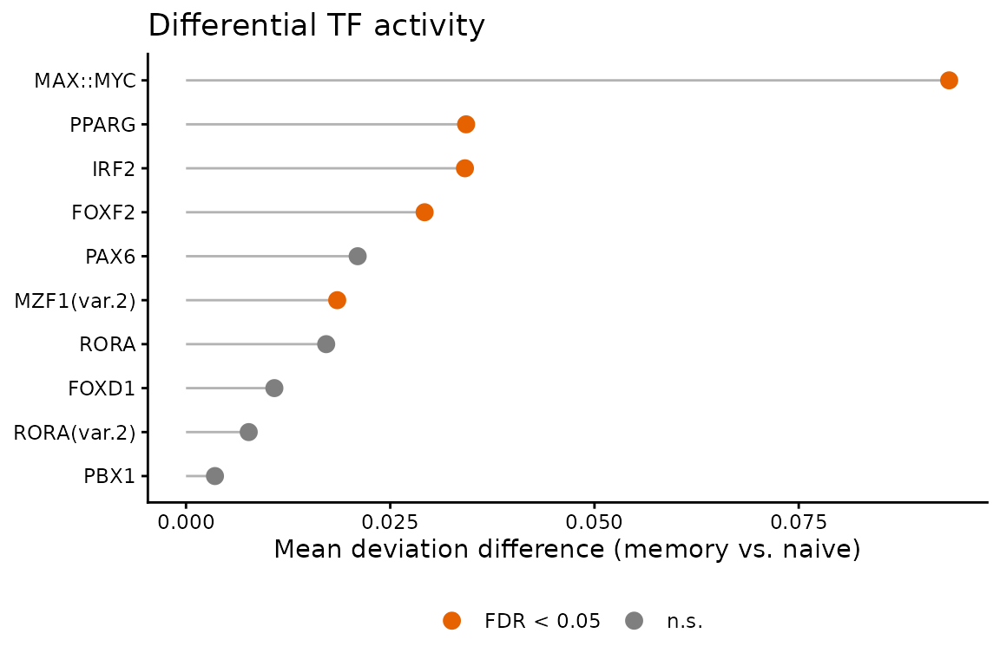

# Case study: TF activity in memory vs. naive T cells

## Overview

CD4+ T cells reshape their regulatory programs as they differentiate
from a naive to a memory state. This case study uses `methylTFR`
deviation scores to ask a focused question: **which transcription
factors show differential activity between memory and naive T cells?**

We reuse deviation matrices bundled with the package (`tc_mem`,
`tc_naive`), so the analysis runs end-to-end without downloading the
*hg38* annotation. See the [Get
started](https://epigenomeinformatics.github.io/methylTFR/articles/methylTFR.md)
vignette for how deviations are computed from raw WGBS data.

``` r
library(methylTFR)
#> Loading required package: data.table
#> Warning: multiple methods tables found for 'sort'
#> Warning: multiple methods tables found for 'sort'
#> Warning: replacing previous import 'S4Arrays::read_block' by
#> 'DelayedArray::read_block' when loading 'HDF5Array'
#> Warning: replacing previous import 'S4Arrays::read_block' by
#> 'DelayedArray::read_block' when loading 'SummarizedExperiment'
#> Warning: multiple methods tables found for 'sort'
#> 
#> Attaching package: 'methylTFR'
#> The following objects are masked from 'package:base':
#> 
#>     cbind, rbind
library(ggplot2)
```

## Deviation data

Each object is a `methylTFRdeviations` matrix of motifs (rows) by
samples (columns). We combine the two groups into a single matrix.

``` r
load(system.file("extdata", "tc_mem.rda", package = "methylTFR"))
load(system.file("extdata", "tc_naive.rda", package = "methylTFR"))

devs <- cbind(tc_mem, tc_naive)
devs
#> class: methylTFRdeviations 
#> dim: 10 10 
#> metadata(0):
#> assays(2): deviations z
#> rownames(10): FOXF2 FOXD1 ... RORA RORA(var.2)
#> rowData names(1): motifs
#> colnames(10): Tc-Mem_OP_S5_Long_D1.bedGraph.bed
#>   Tc-Mem_OP_S4_Long_D60.bedGraph.bed ...
#>   Tc-Naive_OP_S4_Long_D1.bedGraph.bed
#>   Tc-Naive_OP_S3_High_D1.bedGraph.bed
#> colData names(4): CommonMinID condition cell_type bedFile
```

Group labels are taken from the sample names (the prefix before `_`).

``` r
get_groupname <- function(x) unlist(strsplit(x, split = "_"))[1]
groups <- sub(
    ".bedGraph", "",
    vapply(colnames(devs), get_groupname, character(1))
)
table(groups)
#> groups
#>   Tc-Mem Tc-Naive 
#>        5        5
```

## Differential TF activity

[`differential_deviation_test()`](https://epigenomeinformatics.github.io/methylTFR/reference/differential_deviation_test.md)
compares deviation scores between the two groups per motif. With two
groups and `parametric = TRUE` this is a t-test, followed by
Benjamini-Hochberg correction.

``` r
tc_result <- differential_deviation_test(
    deviations = devs,
    groups = groups,
    alternative = "two.sided",
    parametric = TRUE,
    padjMethod = "BH"
)

tc_result <- tc_result[order(tc_result$p_value_adjusted), ]
tc_result
#>                  motifs      p_value p_value_adjusted mean_difference
#> MAX::MYC       MAX::MYC 1.078111e-05     0.0001078111     0.093414294
#> IRF2               IRF2 1.873667e-03     0.0093683362     0.034142762
#> PPARG             PPARG 3.996324e-03     0.0133210805     0.034286836
#> FOXF2             FOXF2 1.694736e-02     0.0355317162     0.029207590
#> MZF1(var.2) MZF1(var.2) 1.776586e-02     0.0355317162     0.018508308
#> PAX6               PAX6 7.709712e-02     0.1284951966     0.021013722
#> RORA               RORA 2.084783e-01     0.2978261195     0.017159124
#> FOXD1             FOXD1 3.644010e-01     0.4555013119     0.010816363
#> RORA(var.2) RORA(var.2) 5.172906e-01     0.5747672942     0.007677473
#> PBX1               PBX1 6.785692e-01     0.6785692148     0.003544582
```

The `mean_difference` column is the absolute difference in mean
deviation between memory and naive cells: larger values flag TFs whose
binding-site methylation shifts most with differentiation.

## Ranking the top TFs

We visualise motifs by effect size, highlighting those passing an FDR
cutoff of 0.05.

``` r
tc_result$motifs <- factor(
    tc_result$motifs,
    levels = tc_result$motifs[order(tc_result$mean_difference)]
)
tc_result$significant <- ifelse(
    tc_result$p_value_adjusted < 0.05,
    "FDR < 0.05", "n.s."
)

ggplot(tc_result, aes(x = mean_difference, y = motifs, colour = significant)) +
    ggplot2::geom_segment(
        aes(x = 0, xend = mean_difference, yend = motifs),
        colour = "grey70"
    ) +
    ggplot2::geom_point(size = 3) +
    ggplot2::scale_colour_manual(
        values = c("FDR < 0.05" = "#E66100", "n.s." = "grey50")
    ) +
    ggplot2::labs(
        x = "Mean deviation difference (memory vs. naive)",
        y = NULL, colour = NULL,
        title = "Differential TF activity"
    ) +
    theme_classic() +
    theme(legend.position = "bottom")
```



## Interpretation

TFs at the top of the ranking are the strongest candidates for driving
memory-specific regulatory changes: their binding sites lose or gain
methylation as cells transition out of the naive state. These hits are a
natural starting point for footprint inspection
([`plotExpectedFootprint()`](https://epigenomeinformatics.github.io/methylTFR/reference/plotExpectedFootprint.md),
shown in the main vignette) or for follow-up in a larger cohort.

Because the bundled data is a small subset (10 motifs, 5 samples per
group), the values here are illustrative. On the full BLUEPRINT memory
T-cell panel the same workflow scales to thousands of motifs via
[`run_methyltfr()`](https://epigenomeinformatics.github.io/methylTFR/reference/run_methyltfr.md).

## Session Information

``` r
sessionInfo()
#> R version 4.4.1 (2024-06-14)
#> Platform: x86_64-conda-linux-gnu
#> Running under: Debian GNU/Linux 11 (bullseye)
#> 
#> Matrix products: default
#> BLAS/LAPACK: /icbb/projects/share/software/packages/miniconda3/envs/igunduz/lib/libopenblasp-r0.3.21.so;  LAPACK version 3.9.0
#> 
#> locale:
#>  [1] LC_CTYPE=en_US.UTF-8       LC_NUMERIC=C              
#>  [3] LC_TIME=en_US.UTF-8        LC_COLLATE=en_US.UTF-8    
#>  [5] LC_MONETARY=en_US.UTF-8    LC_MESSAGES=en_US.UTF-8   
#>  [7] LC_PAPER=en_US.UTF-8       LC_NAME=C                 
#>  [9] LC_ADDRESS=C               LC_TELEPHONE=C            
#> [11] LC_MEASUREMENT=en_US.UTF-8 LC_IDENTIFICATION=C       
#> 
#> time zone: Europe/Berlin
#> tzcode source: system (glibc)
#> 
#> attached base packages:
#> [1] stats     graphics  grDevices utils     datasets  methods   base     
#> 
#> other attached packages:
#> [1] ggplot2_4.0.1     methylTFR_0.99.0  data.table_1.17.2 BiocStyle_2.34.0 
#> 
#> loaded via a namespace (and not attached):
#>  [1] SummarizedExperiment_1.32.0 gtable_0.3.6               
#>  [3] xfun_0.52                   bslib_0.9.0                
#>  [5] htmlwidgets_1.6.4           rhdf5_2.46.1               
#>  [7] Biobase_2.62.0              lattice_0.22-5             
#>  [9] generics_0.1.4              rhdf5filters_1.14.1        
#> [11] vctrs_0.6.5                 tools_4.4.1                
#> [13] bitops_1.0-9                parallel_4.4.1             
#> [15] stats4_4.4.1                tibble_3.2.1               
#> [17] pkgconfig_2.0.3             R.oo_1.27.1                
#> [19] Matrix_1.6-1.1              RColorBrewer_1.1-3         
#> [21] S7_0.2.0                    desc_1.4.3                 
#> [23] S4Vectors_0.40.1            lifecycle_1.0.4            
#> [25] GenomeInfoDbData_1.2.13     stringr_1.5.1              
#> [27] compiler_4.4.1              farver_2.1.2               
#> [29] textshaping_0.4.0           GenomeInfoDb_1.42.3        
#> [31] htmltools_0.5.8.1           sass_0.4.10                
#> [33] RCurl_1.98-1.13             yaml_2.3.10                
#> [35] pillar_1.10.2               pkgdown_2.2.0              
#> [37] crayon_1.5.3                jquerylib_0.1.4            
#> [39] R.utils_2.13.0              DelayedArray_0.28.0        
#> [41] cachem_1.1.0                abind_1.4-8                
#> [43] tidyselect_1.2.1            digest_0.6.37              
#> [45] stringi_1.8.4               dplyr_1.1.3                
#> [47] bookdown_0.43               labeling_0.4.3             
#> [49] fastmap_1.2.0               grid_4.4.1                 
#> [51] cli_3.6.3                   SparseArray_1.2.4          
#> [53] magrittr_2.0.3              logger_0.4.0               
#> [55] S4Arrays_1.6.0              dichromat_2.0-0.1          
#> [57] withr_3.0.2                 UCSC.utils_1.2.0           
#> [59] scales_1.4.0                rmarkdown_2.29             
#> [61] XVector_0.42.0              httr_1.4.7                 
#> [63] matrixStats_1.1.0           ragg_1.3.3                 
#> [65] R.methodsS3_1.8.2           HDF5Array_1.30.1           
#> [67] evaluate_1.0.3              knitr_1.50                 
#> [69] GenomicRanges_1.54.1        IRanges_2.36.0             
#> [71] rlang_1.1.4                 glue_1.7.0                 
#> [73] BiocManager_1.30.25         BiocGenerics_0.52.0        
#> [75] jsonlite_2.0.0              R6_2.6.1                   
#> [77] Rhdf5lib_1.28.0             MatrixGenerics_1.14.0      
#> [79] systemfonts_1.2.3           fs_1.6.6                   
#> [81] zlibbioc_1.52.0
```
