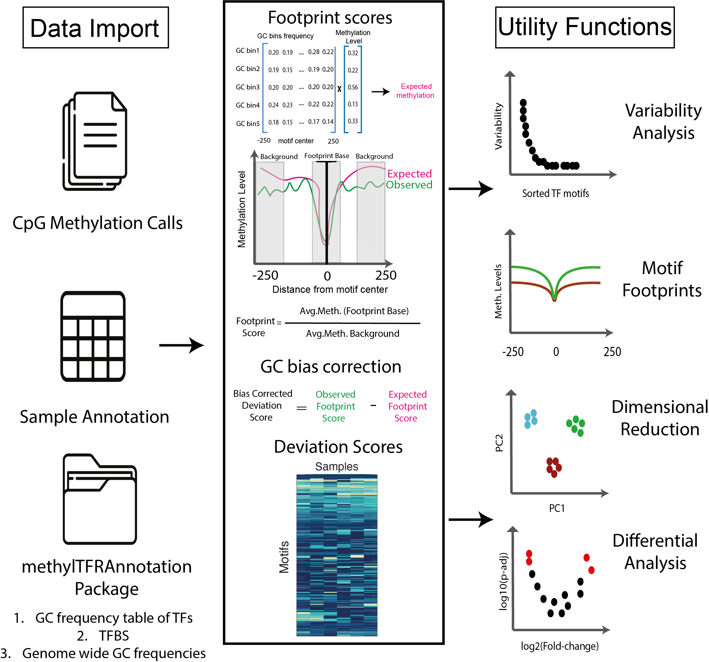

```{r setup, include = FALSE}
library(BiocStyle)
knitr::opts_chunk$set(
  collapse = TRUE,
  comment = "#>"
)
```

## Introduction

DNA methylation can modulate transcription factor (TF) binding,
 particularly when occurring within transcription factor 
 binding sites (TFBS). 
`methylTFR` is an R package that identifies DNA methylation 
signatures at TFBS using whole-genome bisulfite sequencing (WGBS)
 data.

For each sample, methylation levels are first aggregated across all
 genomic regions corresponding to TFBS. This yields the
  **observed deviation**, which captures the raw signal of 
  methylation enrichment or depletion for each TF.
To account for sequence composition biases, `methylTFR` then 
estimates an **expected deviation** using genomic background 
models derived from TF motif GC content and genome-wide GC frequency.
This deviation matrix provides a compact and interpretable 
representation of TFBS methylation across samples, suitable 
for downstream analyses such as dimensionality reduction 
(e.g., PCA, UMAP), clustering, differential testing, and 
visualization of TF-specific methylation footprints. 

{width=80%}

## Installation

`methylTFR` is currently under review for Bioconductor. Until it is
accepted, install the development version from GitHub:

```r
if (!requireNamespace("remotes", quietly = TRUE)) {
  install.packages("remotes")
}
remotes::install_github("EpigenomeInformatics/methylTFR")
```

Once accepted, it will be installable with:

```r
if (!requireNamespace("BiocManager", quietly = TRUE)) {
  install.packages("BiocManager")
}

BiocManager::install("methylTFR")
```

## Getting Started
To get started with **methylTFR**, load the package and its dependencies:

```{r init}
library(methylTFR)
```

### Read a Sample File

The `read_methylome()` function is used to import single-sample
 DNA methylation data into a `GRanges` object.  
It supports several common file formats, including `EPP`, `ALLC`,
 `BisSNP`, `bismarkCytosine`, `bismarkcov`, and `ENCODE`. 

You can optionally filter out low-coverage sites using the 
`cov_threshold` parameter (default = 1), which excludes positions
 with insufficient read support.

Below is an example of reading an example `EPP`-formatted file
 provided in the package:

```{r readmethylome}
epp_path <- system.file("extdata", "epp.tsv.gz", package = "methylTFR")
epp <- read_methylome(epp_path, "EPP")
epp
```


## Annotation Resources

Computing expected deviations requires precomputed annotations for the
genome of interest: transcription factor binding sites, a genome-wide GC
distribution, and per-motif GC frequency tables. These are distributed
separately from `methylTFR`, in an annotation package named after the
assembly, for example `methylTFRAnnotationHg38`. Keeping them out of the
package is a practical necessity: the binding sites alone run to several
gigabytes for a full motif set.

With the annotation package installed, the three resources are retrieved
with `getTFbindsites()`, `getGenomeGC()` and `getGCfreq()`, as shown in
the multi-sample section below.

To build annotations for a different assembly, motif set, or region
restriction, use
[`methylTFRAnnotationBuilder`](https://github.com/EpigenomeInformatics/methylTFRAnnotationBuilder).

The examples in this section instead use a small `BATF` subset bundled
with `methylTFR`, so they run without any annotation package.

### Input Data

`methylTFR` relies on several precomputed annotation resources to estimate 
expected methylation levels at transcription factor binding sites (TFBS). These annotations include:

- **GC distribution (`gcdist_subset`)**: Genome-wide GC content distribution
 around cytosines, used to model methylation expectations.
- **Motif GC frequency (`BATF_gcfreqs`)**: GC frequency profile specific to 
the BATF motif across TFBS, used to correct for sequence composition bias.
- **TF binding sites (`BATF_tf_bindsites`)**: A `GRanges` object containing 
the genomic coordinates of BATF binding sites.
- **Example methylation data (`example_data`)**: A small subset of methylation
 calls in EPP format, read using the `read_methylome()` function, provided for demonstration purposes.

The following code loads these example datasets and displays the first few entries:

```{r exdata}
# Load the data
load(system.file("extdata", "gcdist_subset.rda", package = "methylTFR"))
load(system.file("extdata", "BATF_gcfreqs.rda", package = "methylTFR"))
load(system.file("extdata", "BATF_tf_bindsites.rda", package = "methylTFR"))
load(system.file("extdata", "example_data.rda", package = "methylTFR"))


# Check the data
head(gcdist)
head(gcfreqs$BATF[, 1:5])
head(tf_bindsites)
head(msites)
```

## Compute Deviation Score for a Single Sample and Single Motif

The `computeDeviation()` function calculates the deviation score for a specific
 transcription factor (TF) motif in a single sample. It compares the observed
  methylation at TF binding sites (TFBS) to the expected methylation derived
   from GC frequency models.

This example uses the `BATF` motif and the example methylation dataset loaded
 earlier. The methylation data must first be binned by GC content using
  `addGCBintoMethylome()` before computing the deviation.

```{r single_deviation}
# Add GC bins to methylation data
bin_meth <- addGCBintoMethylome(msites, gcdist, ignoreStrand = TRUE)
bin_meth

# Compute deviation score for BATF motif
deviation_score <- computeDeviation(
  motif = "BATF",
  msites = msites,
  tf_bindsites = tf_bindsites,
  gcfreqs = gcfreqs,
  enhancer = NULL,
  ignoreStrand = TRUE,
  binMsites = bin_meth
)

# View the result
deviation_score
```


## Run methylTFR on multiple samples and motifs 
The `methylTFR` package provides a `run_methyltfr` function to run
 the analysis on multiple samples and motif sites.
You need to download the annotation package for the human genome
 (*hg38*) and place it in your working directory.

```{r multiple_samples, eval=FALSE}
library(methylTFRAnnotationHg38) # annotation package for hg38

gcfreqs <- getGCfreq(motifSet = "jaspar2020")
gc_dist <- getGenomeGC("hg38")
tf_bindsites <- getTFbindsites(motifSet = "jaspar2020")

sample_dir <- file.path("samples_dir")
sample_ann <- "samples.tsv" # should contain column name bedFile

# deviation score matrix
deviations <- run_methyltfr(sample_ann, # sample annotation file
  sample_dir, # where the EPP files are
  threads = 8, # number of threads
  chunkSize = 10, # number of chunks to process
  sampleColName = "bedFile", # column name for EPP file paths in sample_ann
  tf_bindsites = tf_bindsites, # TF binding sites
  gcfreqs = gcfreqs, # GC frequency
  gc_dist = gc_dist, # GC distribution
  filetype = "EPP" # file type
)
```


## Run methylTFR directly on an RnBeads object

If the methylation data has already been imported and preprocessed with
[`RnBeads`](https://bioconductor.org/packages/RnBeads), there is no need
to export per-sample files first. `run_methylTFR_RnBeads()` takes the
`RnBSet` object directly and returns the same `methylTFRdeviations`
object as `run_methyltfr()`.

Methylation levels are read one sample column at a time, so disk-backed
sets created with `disk.dump.big.matrices = TRUE` are never loaded into
memory in full.

```{r rnbeads, eval=FALSE}
library(RnBeads)
library(methylTFRAnnotationHg38)

rnb_set <- load.rnb.set("reports/data_import_data/rnb.set_preprocessed")

gcfreqs <- getGCfreq(motifSet = "jaspar2020")
gc_dist <- getGenomeGC("hg38")
tf_bindsites <- getTFbindsites(motifSet = "jaspar2020")

deviations <- run_methylTFR_RnBeads(
  rnb_set = rnb_set, # preprocessed RnBeads object
  tf_bindsites = tf_bindsites, # TF binding sites
  gcfreqs = gcfreqs, # GC frequency
  gc_dist = gc_dist, # GC distribution
  threads = 8, # number of threads
  chunkSize = 10, # number of motifs per chunk
  cov_threshold = 1 # minimum coverage per site
)
```

Methylation calls are always read at single-cytosine resolution. Region
summaries such as `tiling1kb` or `distal` cannot be used, because a
footprint needs base-resolution calls. To restrict the analysis to a set
of regulatory regions, pass them through the `enhancer` argument:

```{r rnbeads_distal, eval=FALSE}
distal <- readRDS("distal_regions.RDS") # a GRanges of distal regions

deviations_distal <- run_methylTFR_RnBeads(
  rnb_set = rnb_set,
  tf_bindsites = tf_bindsites,
  gcfreqs = getGCfreq(motifSet = "jaspar2020_distal"),
  gc_dist = gc_dist,
  enhancer = distal,
  threads = 8
)
```

Coverage filtering applies only to sequencing-based sets
(`RnBiseqSet`), which carry coverage information. For array-based sets
`cov_threshold` is ignored and a message is emitted.

`RnBeads` is a suggested dependency rather than a required one, so it is
only needed if this entry point is used.

## Session Information
```{r session-info}
sessionInfo()
```

