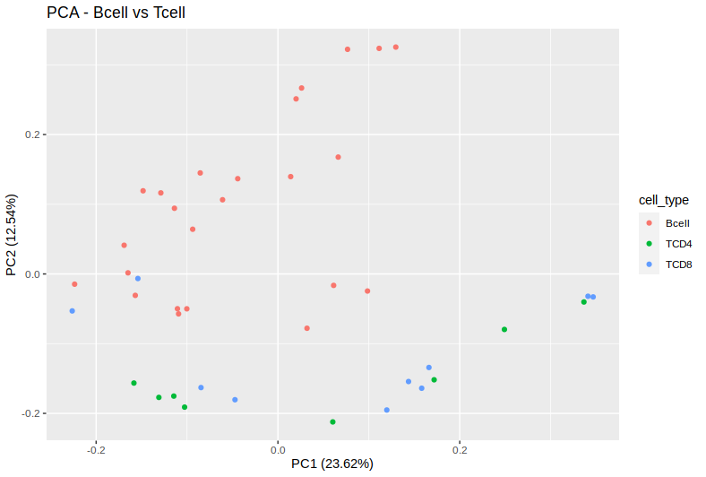
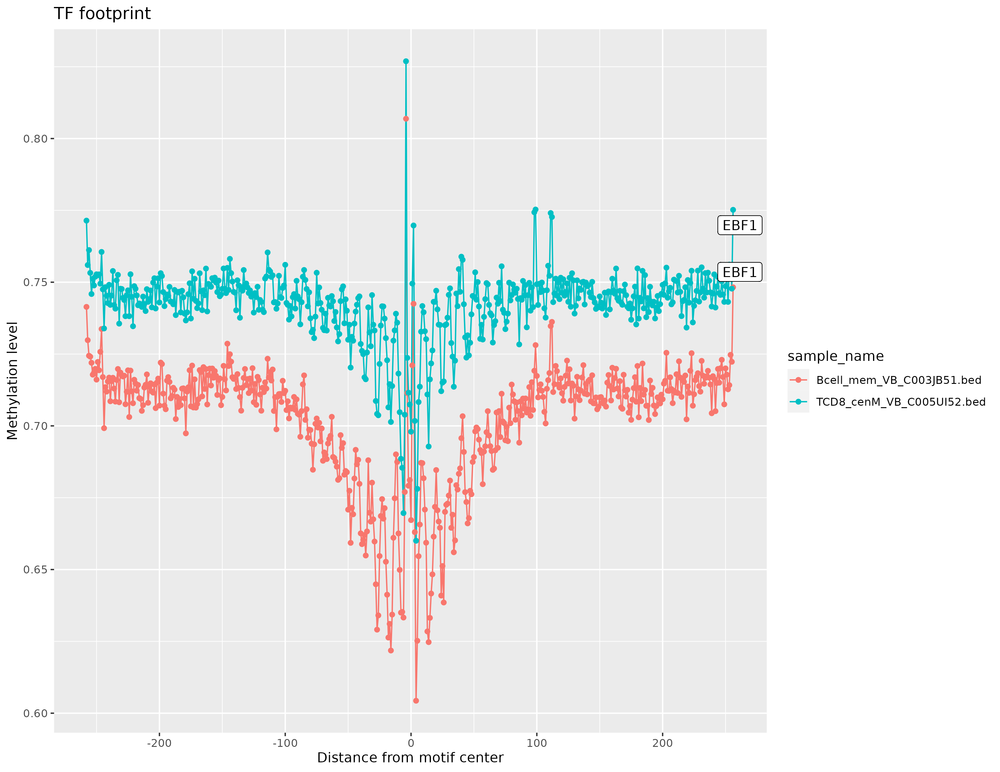

# Introduction

`methylTFR` is an R-package to analyze the methylation data from whole genome bisulfite sequencing (WGBS). It takes inputs as bedfiles from RnBeads pipeline (bed - EPP format) and this tool aims to identify the methylation patterns on transcription factor binding sites (TFBS) in each individual cells or samples. Transcription Factors (TF) are important proteins that can bind to specific DNA sequences (motifs or TFBS) to regulate the gene expressions. we know that highly methylated DNA sequences are negatively affects the TF-DNA interaction. Here, we are trying to model the methylation signals for each TF binding profiles.

`methylTFann` is a data package that includes TF motif annotation informations to process methylation data. `methylTFR` provides a simple function to process large number of data-sets. In this vignette, we will handle WGBS data of human haematopoietic cells from the blueprint epigenome project. Bedfiles and sample annotation files will be included in the example data set to run this programme, and a deviation score matrix will be constructed for this example dataset. This deviation matrix can be used for other downstream analysis such as exploratory analysis (dimentionality reduction, clustering), differential analysis.


# Dependencies

The following packages are required to run this tool.

-   R (\>= 3.5.0)
-   devtools
-   GenomicRanges
-   data.table
-   dplyr
-   stringr
-   logger
-   parallel

If you haven't installed these packages, you can install using the following code.

```{r, eval = FALSE}
if (!require("BiocManager", quietly = TRUE))
    install.packages("BiocManager")

BiocManager::install("GenomicRanges")
install.packages(c("data.table", "stringr", "dplyr", "logger"), \
                 repos = "https://cran.uni-muenster.de/")

```

# Installation

Required dependencies (R packages) should be installed before installing the `methylTFR`.

```{bash, eval = FALSE}
# install devtools if not previously installed
Rscript -e "if (!is.element('devtools', installed.packages()[,'Package'])) install.packages('devtools')"
#  clone the GitHub repo
git clone git@github.com:EpigenomeInformatics/methylTFR.git
cd methylTFR
Rscript -e "library(devtools); devtools::install('.')"
```

# Loading the annotation files

Load the required annotation files from `methylTFRann` package.

```{r, eval = FALSE}
library(methylTFRann)
library(parallel)

# load annotation files from methylTFRann
tf_bindsites <- getTFbindsites()
gc_dist <- getGenomeGC()
motif_gcfreq <- getGCfreq()
motif_list <- names(motif_gcfreq)
```

# Example dataset

We present an example data-set of methylation profiles from the BLUEPRINT epigenome database of 26 human bcell samples (only chromosome 21) for the sake of simplicity in this tutorial. This dataset includes RnBeads processed bed files as well as an example sample annotation file. You can download this dataset using following command

```{bash, eval = FALSE}
# bcell_
wget https://drive.google.com/file/d/1WBOkamxbS2WZGHhsD5pKIm4HDcDB3lOi/view?usp=share_link
untar -xvzf bcells_example_data.tar.gz
```

# Running methylTFR

We just need a few R commands to apply methylTFR on a large number of samples.The majority of the information is saved in GenomicRanges objects in the annotation package to speed up processing. And it requires more CPU memory (\> 10 GB RAM).

```{r, eval = FALSE}
# loading libraries 
library(GenomicRanges)
library(dplyr)
library(methylTFRann)
library(methylTFR)

sample_dir <- file.path("bcells")
sample_ann <- "samples.tsv"

# deviation score matrix
deviations <- run_methyltfr(sample_ann,
                            sample_dir,
                            threads = 8)
```

# Exploratory Analysis

Exploratory analysis is a tool used to explore the data. It can be used for various purposes such as getting an overview of the deviation score, give insight into the relationships between variables and looking for patterns within the data to make informed decisions on how to use what you've learned.

## Dimentionality Reduction - PCA

Principal component analysis (PCA) is a dimensionality reduction technique that aims to make a dataset easier to interpret. It works by creating a new set of variables (Prinicipal Components) that can explain most of the variation in the original data and removes some of the remaining variation.

```{r, eval = FALSE}
# load example deviation matrix from methylTFR
data(example_deviations, package = "methylTFR")

# loading libraries for PCA
library(factoextra)
library(ggfortify)

# helper function to parse the sample name
get_groupname <- function(x) {
  return(unlist(strsplit(x, split = "_"))[1])
}

tdf <- as.data.frame(t(example_deviations))
groups <- unlist(lapply(FUN = get_groupname, X = colnames(example_deviations)))
tdf$cell_type <- groups

# skip cell_type column 
pca <- prcomp(tdf[, -633])

autoplot(pca, data = tdf,
         colour = 'cell_type', 
         main = "PCA - Bcell vs Tcell") 

```



## UMAP

Uniform Manifold Approximation and Projection (UMAP) is an another dimension reduction technique that can be used for visualisation similarly to t-SNE, but also for general non-linear dimension reduction. We can use `UMAP` R package to use this approach.

```{r, eval = FALSE}
library(umap)

umap_fit <- as.data.frame(t(example_deviations)) %>% 
  select(where(is.numeric)) %>%
  scale() %>% 
  umap()

umap_df <- umap_fit$layout %>%
  as.data.frame()%>%
  rename(UMAP1="V1",
         UMAP2="V2")


ggplot(data = umap_df, 
       aes(x = UMAP1, 
           y = UMAP2, 
           color = group)) +
  geom_point() +
  labs(x = "UMAP1",
       y = "UMAP2",
       subtitle = "UMAP plot -  motifs") 
```

# Differential Analysis

Differential analysis is a statistical technique that is used to quantify the difference in the mean of two groups. We offer the 'differential deviation test' function in this case to do the analysis. This function accepts a vector of group names and a matrix of deviation scores. Wilcoxon test will be conducted between two groups if the group size is equal to two, and Kruskal-Wallis rank sum test will be conducted for multiple groups. The resulting matrix includes motif, p-value, and adj.p-value (BH correction).

```{r, eval = FALSE}
# merging TCD4 and TCD8 into single group
match <- which(groups %in% c("TCD4", "TCD8"))
groups[match] <- "Tcell"
groups <- as.factor(groups)

diff <- differential_deviation_test(example_deviations, groups = groups)

dim(diff[diff$p_value_adjusted < 0.05, ])
# [1] 173   3

head(diff[diff$p_value_adjusted < 0.05, ])
#                 motifs      p_value      adj.p_value
#FOXD1             FOXD1 8.152009e-03     0.0330260877
#PPARG             PPARG 4.139074e-05     0.0005231789
#RORA(var.2) RORA(var.2) 8.377320e-06     0.0001707892
#RXRA::VDR     RXRA::VDR 1.229088e-03     0.0075415914
#REST               REST 1.034783e-02     0.0393965505
#RARA::RXRA   RARA::RXRA 4.782239e-04     0.0036414154
```

# TF motif footprinting

Transcription factor footprinting analysis is a technique where DNA methylation levels are taken into account. Transcription factors couples the expression of genes, so it is the key which determines which genes have the potential to be expressed or not. Here, we're attempting to present an overview of the methylation patterns near TF motifs.

```{r, eval = FALSE}
samples <- c("Bcell_mem_VB_C003JB51.bed", "TCD8_cenM_VB_C005UI52.bed")
motifs <- c("EBF1")
plot_footprint(motifs, tf_bindsites, samples, img = "TF_footprint_EBF1.png")
```


